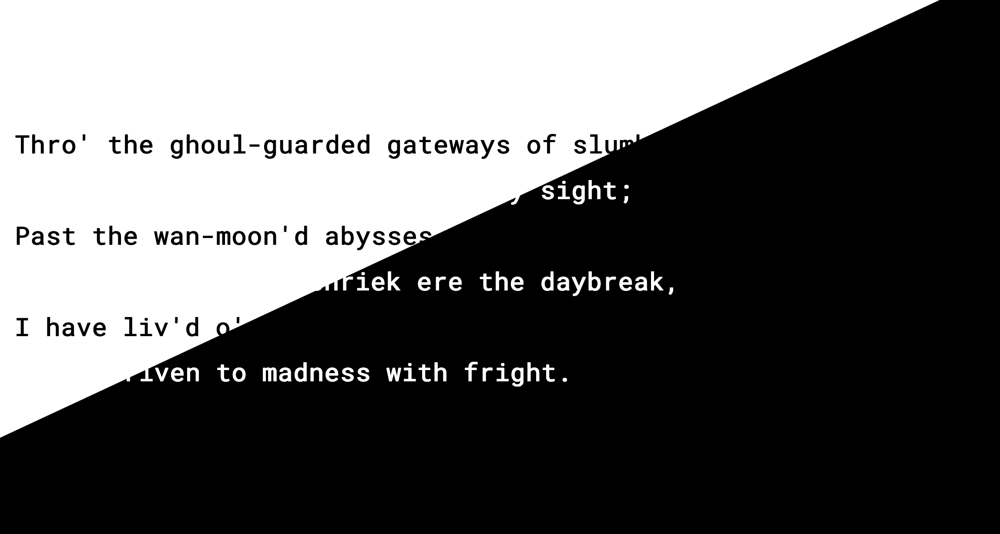

# Lovecraft Project

Fun with parallax layering and monochrome.
See a live demo [here](https://stoic-kare-39f1b8.netlify.com/).




## Requirements

* Node > 7.6
* A screen that is 13" or larger

## Getting started

Clone the repository
```
git clone https://github.com/justinh5/lovecraft_project.git
cd PROJECT-NAME
```
Intall dependencies
```
npm install
```

Start development server
```
npm start
```
Open browser on localhost:8080


## To-Do List

* Complete all stanzas
* Support devices smaller than 13"
* Add in more detailed graphics + animations

## Authors

Matt Groberg & Justin Haupt

All vagabonds, mystics, and tentacles are welcome to contribute

## License

This project is licensed under the MIT License. Content is licensed under CC-BY-SA-4.0. See the license for details
